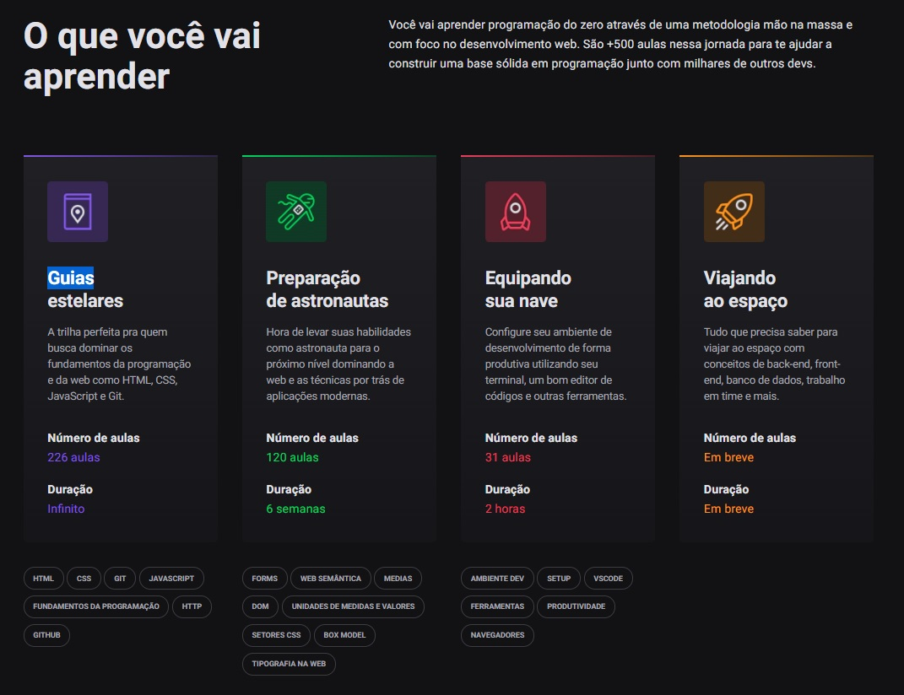

<h2 align="center">
   Discover Rocketseat | 
</h2>

<h3 align="center">

   

🚧 Em andamento 🚧

</h3>

---

  <a href="#-Sobre">Sobre</a> |
  <a>
  <a href="#-Notas-de-aula">Notas de aula</a> |
  <a href="#-Desafios">Desafios</a> |
  <a href="#-Entre-em-contato">Contato</a>

## 📚 Sobre

Criado pela <a href="https://rocketseat.com.br/" target="_blank">Rocketseat</a>, O Discover é um programa gratuito de formação de devs, feito para você aprender do zero programação com foco em desenvolvimento web. O principal objetivo do programa é te ajudar a conquistar sua primeira oportunidade profissional nessa área.
Na plataforma você terá acesso a mais de 500 aulas — e crescendo — para você ir desde a sua primeira linha de código a preparação para desafios maiores.
Você vai aprender através de uma metodologia mão na massa, com apoio da comunidade e dos nossos instrutores, em aulas guiadas por educadores dedicados ao programa.<a href="https://rocketseat.com.br/discover" target="_blank">Clique aqui e entre no discover.</a>

---

## 🚀 Trilhas

### Equipando sua nave

  
 Ambiente Dev de outro mundo

- Módulo 01 | Instalando Vs code ✔️
- Módulo 02 | Instalando NodeJs ✔️
- Módulo 03 | Instalando Chrome ✔️

 Terminal sua segunda casa

- Módulo 01 | Abertura
- Módulo 02 | Preparação e Dicas
- Módulo 03 | Arquivos e Diretórios

### Guias Estelares

  
 Guia estelar de Programação ✔️

- Módulo 01 | Ambiente Dev de outro mundo ✔️
- Módulo 02 | Terminal sua segunda casa

  
Guia estelar de HTTP

- Módulo 01 | Entendendo 🚧
- Módulo 02 | Conceitos 🚧
- Módulo 03 | Uri 🚧
- Módulo 04 | Messages 🚧
- Módulo 05 | Methods 🚧
- Módulo 06 | Headers 🚧
- Módulo 07 | Status 🚧

  
Guia estelar de HTML

  
Guia estelar de Css ✔️

  
Guia estelar de JavaScript ✔️

- Módulo 08 | Expressões e Operadores 🚧
- Módulo 09 | Condicionais e controle de fluxo 🚧
- Módulo 10 | Estruturas de repetição 🚧
- Módulo 11 | Consolidando com exercícios 🚧

  
Guia estelar de Git ✔️

- Módulo 01 | Introdução ✔️
- Módulo 02 | O que é git ✔️
- Módulo 03 | Instalando Git ✔️
- Módulo 04 | Começando ✔️
- Módulo 05 | Conceitos ✔️
- Módulo 06 | Alterando arquivos ✔️
- Módulo 07 | Desfazendo mudanças ✔️
- Módulo 08 | Usando git em um projeto real ✔️

  
Guia estelar de Github ✔️

- Módulo 01 | Introdução ✔️
- Módulo 02 | Primeiros passos ✔️
- Módulo 03 | Criando repositórios ✔️
- Módulo 04 | Trabalhando com repositórios ✔️
- Módulo 05 | Outras features ✔️

### Preparação de astronautas

  
Guia estelar de Github

### Viajando ao espaço

  
NodeJs: O motor da nave

- Módulo 1 | Conhecendo o Node ✔️
- Módulo 2 | Configurando o ambiente ✔️
- Módulo 3 | Iniciando na prática ✔️
- Módulo 4 | NPM - Node Package Manager ✔️
- Módulo 5 | BestMe App ✔️
- Módulo 6 | Timers ✔️
- Módulo 7 | Events ✔️

  
NodeJs + EJS:HTML inteligente

  
  - Criando o Html 
  - Criando o Servidor
  - Layout
  - Nova página e menu
  - Organização
  - Pesquisando um objeto
  - Foreach

  
SQL: A caixa preta da nave

- Módulo 1 | Introdução ✔️
- Módulo 2 | Conceitos ✔️
- Módulo 3 | Tipos de campos ✔️
- Módulo 4 | Comando SELECT ✔️
- Módulo 5 | Operadores Relacionais ✔️
- Módulo 6 | Operadores Matemáticos ✔️
- Módulo 7 | Operadores Lógicos ✔️
- Módulo 8 | Mais Comandos ✔️
- Módulo 9 | Unindo tabelas ✔️
- Módulo 10 | Comandos Avançados ✔️
- Módulo 11 | Comandos nas tabelas ✔️

## 👥 Instrutores

##### 👩‍💻 Jakeliny Gracielly

- 
- 

##### 👨🏻‍💻 Mayk Brito

- 
- 

---

<!-- ## 📝 Notas de aula -->

## 👤 Autor 

**Savio Nascimento**

- 
- 

---
