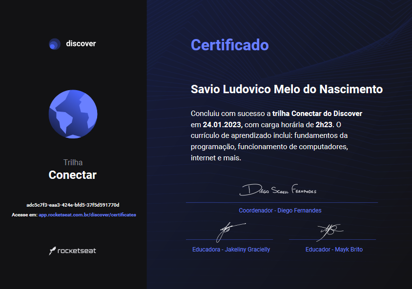

<h2 align="center">
   Discover Rocketseat | 
</h2>

<h3 align="center">

   

🚧 Em andamento 🚧

</h3>

---

  <a href="#-Sobre">Sobre</a> |
  <a href="#-Notas-de-aula">Notas de aula</a> |
  <a href="#-Desafios">Desafios</a> |
  <a href="#autor">Contato</a>

## 📚 Sobre

Criado pela <a href="https://rocketseat.com.br/" target="_blank">Rocketseat</a>, O Discover é um programa gratuito de formação de devs, feito para você aprender do zero programação com foco em desenvolvimento web.
Esse repositório foi feito para estudos/treinamentos das aulas dessa plataforma.

---

## Conectar

- Guia estelar de Programação ✅
- Computador, Software e Hardware ✅
- Internet, Roteadores e Servidores ✅
- Sistemas Operacionais ✅
- Linguagens de Programação ✅
- Tipos de aplicações web ✅

## 

## Fundamentar

- Ambiente Dev ✅
- Guia estelar de Css 🚧
- Nem tudo são Pixels 🚧
- Uma caixa dentro da outra 🚧
- Agora sim, cores 🚧
  - Cores 🚧
  - Background 🚧
- Posso ver e ouvir o HTML 🚧
  - Audio e Vídeo 🚧
  - Images 🚧
- Posicionando foguetes 🚧
- App bonito, até nos textos 🚧
  - Trabalhando com fontes 🚧
  - Mais estilos para os textos 🚧
- Formulários de outro planeta 🚧
  - Introdução ✅
  - Estrutura ✅
  - Tags de Entrada de Dados 🚧
  - Criando um formulário 🚧
- HTML que faz sentido, para todos ✅
- Nem só de classes ou IDs 🚧
  - Selectors and Combinators 🚧
  - Pseudo-classes 🚧
  - Pseudo-elements 🚧

    
Alinhando os planetas 🚧

- Introdução 🚧
- Layouts CSS 🚧
- Terminologia 🚧
- Propriedades do Flex Container 🚧
- Propriedades dos Itens 🚧
- Desafios 🚧

    
Pilotando com a DOM 🚧

- Introdução 🚧
- Selecionando elementos 🚧
- Manipulando conteúdos 🚧
- Manipulando estilos e classes 🚧
- Navegando pelos elementos 🚧
- Criando e adicionando elementos na página 🚧
- Eventos 🚧
- Praticando 🚧

    
Terminal 🚧

- Abertura 🚧
- Preparação e Dicas 🚧
- Arquivos e Diretórios 🚧

  
SQL 🚧

- Introdução 🚧
- Conceitos 🚧
- Configurando Ambiente 🚧
- Tipos de campos 🚧
- Comando SELECT 🚧
- Operadores Relacionais 🚧
- Operadores Matemáticos 🚧
- Operadores Lógicos 🚧
- Mais Comandos 🚧

  
NodeJs 🚧

- Conhecendo o Node 🚧
- Configurando o ambiente 🚧
- Iniciando na prática 🚧
- NPM - Node Package Manager 🚧
- BestMe App: Interagindo com o aplicativo 🚧
- Timers 🚧
- Events 🚧

 

- NodeJS + EJS 🚧
- Estrutura de Dados 🚧
- Programação Orientada a Objetos 🚧
- Programaçao Funcional 🚧

### Guias Estelares

  
Guia estelar de HTML 🚧

- Conceitos 🚧
- Trabalhando com elementos 🚧
- Links 🚧
- Tabelas 🚧
- Cabeçalho 🚧

  
Guia estelar de JavaScript 🚧

- Introdução 🚧
- Primeiros Passos 🚧
- Tipos de dados 🚧
- Variáveis 🚧
- Praticando e avançando 🚧
- Funções 🚧
- Manipulando dados 🚧
- Expressões e Operadores 🚧
- Condicionais e controle de fluxo 🚧
- Estruturas de repetição 🚧
- Consolidando com exercícios 🚧

  
Guia estelar de HTTP 🚧

- Entendendo 🚧
- Conceitos 🚧
- Uri 🚧
- Messages 🚧
- Methods 🚧
- Headers 🚧
- Status 🚧

  
Guia estelar de Git 🚧

- Introdução 🚧
- O que é git 🚧
- Instalando Git 🚧
- Começando 🚧
- Conceitos 🚧
- Alterando arquivos 🚧
- Desfazendo mudanças 🚧
- Usando git em um projeto real 🚧

  
Guia estelar de Github 🚧

- Introdução 🚧
- Primeiros passos 🚧
- Criando repositórios 🚧
- Trabalhando com repositórios 🚧
- Outras features 🚧

---

## Especializar

- Javascript Assíncrono e Promises 🚧
- Fundamentos do Typescript 🚧
- Github para times 🚧
- Transition e Animation 🚧

    
Trabalhando com APIs 🚧

- Inicio 🚧
- Api no Back-End 🚧
- Parâmetros nas Requisições 🚧
- Consumindo API com NodeJs 🚧
- API no Front-End com Fetch 🚧
- API no Front-End com Axios 🚧

  
SQL Avançado 🚧

- Conceitos 🚧
- Tipos de campos 🚧
- Iniciando o banco de dados 🚧
- Unindo tabelas 🚧
- Comandos avançados 🚧
- Comandos nas tabelas 🚧

---

## 👤 Autor 

**Savio Nascimento**

- 
- 

---
